<p align="center">
  
</p>

<div align="center">

# 🎓 NCMS-SITE

### Nagarjuna College of Management Studies — Official Website Platform

_A premium, content-driven institutional website built with **Next.js**, powered by an **Express + MongoDB** API with **seeding**, and managed through a dedicated **React Admin Panel** — every page beautifully designed in the NCET/NDC design language._

</div>

<div align="center">


</div>

<p align="center">
  
</p>

---

## 📖 Table of Contents

<p align="center">
  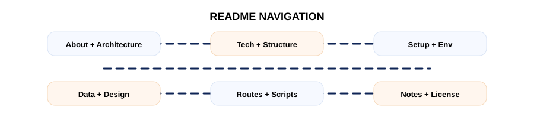
</p>

<div align="center">

| | |
| --- | --- |
| [✨ About The Project](#-about-the-project) · [🏗️ Architecture](#️-architecture) | [🧱 Tech Stack](#-tech-stack) · [📁 Project Structure](#-project-structure) |
| [🚀 Getting Started](#-getting-started) · [🔐 Environment Variables](#-environment-variables) | [🗄️ Data Architecture](#️-data-architecture) · [🎨 Design System](#-design-system) |
| [📄 Pages & Routes](#-pages--routes) · [🧰 Available Scripts](#-available-scripts) | [👨‍💻 Developer Notes](#-developer-notes) · [🤝 Contributing](#-contributing) |

</div>

---

## ✨ About The Project

<p align="center">
  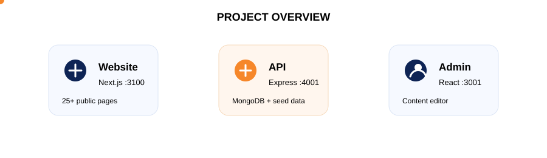
</p>

**NCMS-SITE** is the complete digital ecosystem for **Nagarjuna College of Management Studies**, Bengaluru — a three-part platform:

<div align="center">

| Layer | What it does | Port |
| --- | --- | --- |
| 🌐 **Public Website** | The student-facing **Next.js 15** site — 25+ pages with animations, image galleries, PDF document libraries, blogs and contact flows. | `3100` |
| ⚙️ **API Backend** | **Express + MongoDB** REST API that mirrors the content collections, seeds the database from JSON, and powers both the website and the admin panel. | `4001` |
| 🛠️ **Admin Panel** | A **React** dashboard for managing content, users, blogs and submissions with a polished Skote-style UI. | `3001` |

</div>

> 💡 **Design philosophy:** the UI is pixel-matched to the **NCET** and **NDC** college websites — same typography, same spacing, same navy `#0e2455` + orange `#F6872A` identity, same micro-interactions — but with **NCMS content** throughout.

### Key Features

<p align="center">
  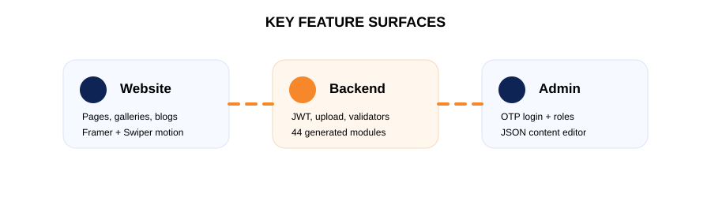
</p>

<div align="center">

| | | |
| --- | --- | --- |
| 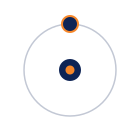 | **🌐 Website Highlights**<br/>25+ responsive pages · department hubs with tabbed About / HOD / Vision & Mission / PEOs / Syllabus / Faculty · premium Framer Motion animations · Swiper carousels · graceful JSON fallback so the site *never* shows a blank page. |  |
|  | **⚙️ Backend Highlights**<br/>Express + Mongoose API with JWT authentication, role-based routes, `multer` uploads and `express-validator` · one-command JSON seeding (`npm run seed`) · 44 generated content modules. |  |
|  | **🛠️ Admin Panel Highlights**<br/>OTP login flow · role-aware dashboards (admin / COO / dean / principal / HOD / faculty) · generic JSON-driven content editor with per-page read/write grants · SweetAlert2 + toast UX. |  |

</div>

---

## 🏗️ Architecture

### Animated Architecture

<p align="center">
  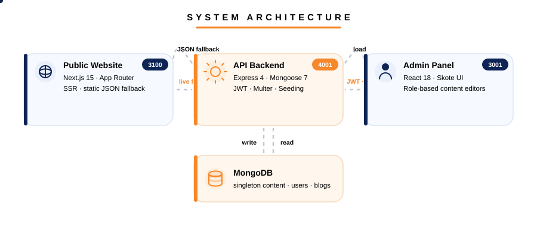
</p>

### Original Architecture

```
 Admin (React · :3001) ──JWT/save──▶ API (Express · :4001) ◀──live fetch── Web (Next.js · :3100)
        ▲                              │       ▲                             │
        └────────────load──────────────┘       └──read/write──▶ MongoDB      │
                                                                             │
                                              data-export/*.json ◀──fallback─┘
```

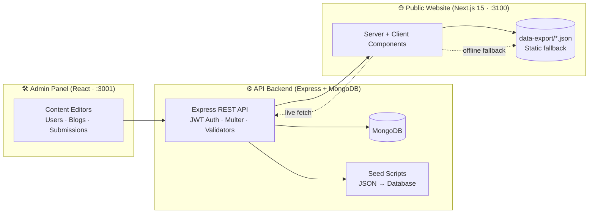

---

## 🧱 Tech Stack

<p align="center">
  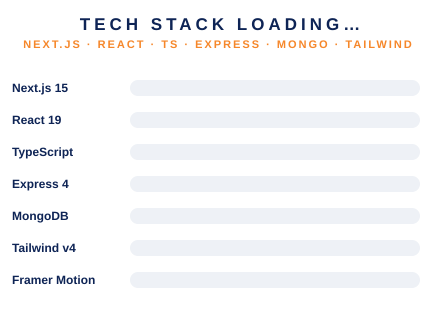
</p>

<div align="center">

| Layer | Technology | Purpose |
| --- | --- | --- |
| **Frontend** | [Next.js 15.2](https://nextjs.org) · React 19 · TypeScript 5 | App Router, Server/Client components, SSR + hydration |
| **Styling** | Tailwind CSS v4 · SCSS/Sass · Mantine 7 | Utility-first styling, custom design-system SCSS, UI primitives |
| **Motion** | Framer Motion 12 · Swiper 11 | Scroll reveals, count-ups, carousels, micro-interactions |
| **Icons** | lucide-react · react-icons · Font Awesome · Tabler | Consistent iconography across every page |
| **Forms** | react-hook-form | Contact & apply-now forms with validation |
| **API** | Express 4 · Mongoose 7 · MongoDB · JWT | REST API, auth, uploads, seeding |
| **Admin** | React 18 · Redux Toolkit · reactstrap · Bootstrap 5 | Admin dashboard on port `3001` |

</div>

---

## 📁 Project Structure

<p align="center">
  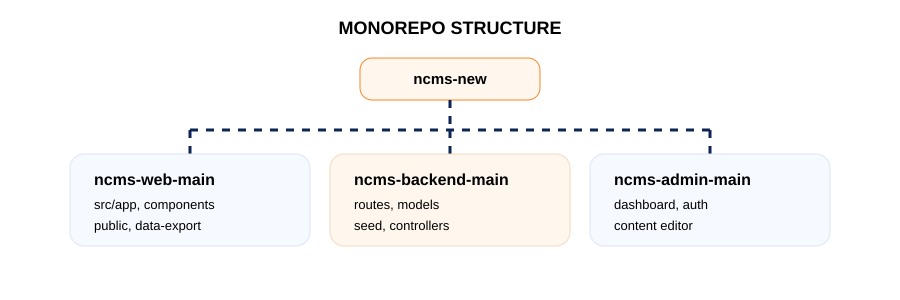
</p>

```
ncms-new/
├── 📄 README.md                      ← you are here
├── 📄 DEVELOPER.md                   ← developer notes & credits
├── 🎞️ assets/                        ← animated SVG loaders, hero & architecture
│
├── 🌐 ncms-web-main/                 # Public website (Next.js 15)
│   ├── src/
│   │   ├── app/                      # App Router pages (25+ routes)
│   │   ├── components/               # Reusable UI (Header, Footer, PageBanner, …)
│   │   ├── styles/ncet/              # Design-system SCSS/CSS (NCET port)
│   │   ├── data-export/              # Bundled static JSON fallbacks
│   │   ├── services/                 # API service layer
│   │   └── hooks/                    # useLiveData (live → JSON fallback)
│   └── public/                       # Images, PDFs, uploads
│
├── ⚙️ ncms-backend-main/             # API backend (Express + MongoDB)
│   ├── app.js                        # Express bootstrap
│   ├── models/  routes/  controllers/# MVC modules (44 generated)
│   ├── seed/                         # runSeed.js · seedAdmin.js
│   └── scripts/                      # Module generator
│
└── 🛠️ ncms-admin-main/               # Admin panel (React · :3001)
    └── src/                          # Skote-style dashboard, editors, auth
```

---

## 🚀 Getting Started

<p align="center">
  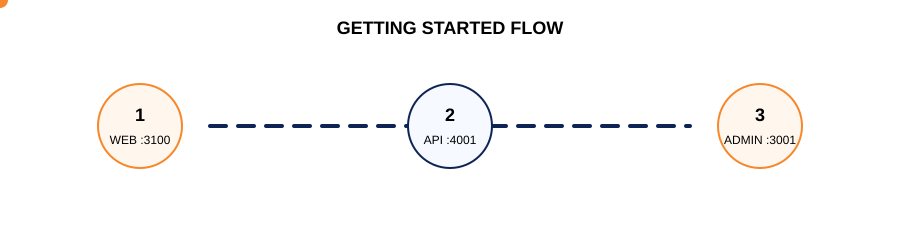
</p>

> **Prerequisites:** Node.js ≥ 18, npm ≥ 6, MongoDB running locally.

<div align="center">

| | | |
| --- | --- | --- |
|  | **1 · Public Website**<br/><code>cd ncms-web-main && npm install && npm run dev</code><br/>→ `http://localhost:3100` | Works out of the box on bundled JSON |
|  | **2 · API Backend**<br/><code>cd ncms-backend-main && npm install && npm run seed && npm run dev</code><br/>→ `http://localhost:4001` | Seeds every collection from JSON |
|  | **3 · Admin Panel**<br/><code>cd ncms-admin-main && npm install && npm start</code><br/>→ `http://localhost:3001` | Skote-style dashboard |

</div>

---

## 🔐 Environment Variables

<p align="center">
  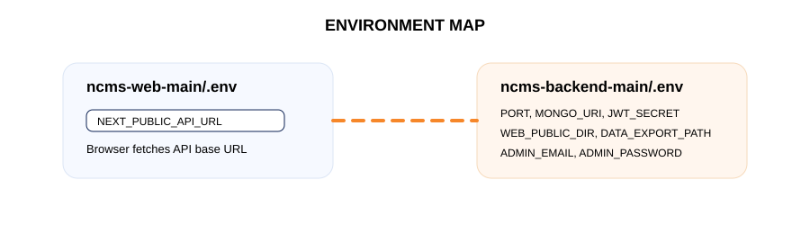
</p>

### `ncms-web-main/.env`

| Variable | Description | Default |
| --- | --- | --- |
| `NEXT_PUBLIC_API_URL` | Live backend base URL | `http://localhost:4001` |

### `ncms-backend-main/.env`

| Variable | Description |
| --- | --- |
| `PORT` | API port (default `4001`) |
| `MONGO_URI` | MongoDB connection string |
| `JWT_SECRET` | Token signing secret |
| `ADMIN_EMAIL` / `ADMIN_PASSWORD` | Default admin seed credentials (via `npm run seed:admin`) |
| `WEB_PUBLIC_DIR` | Where uploads are written (defaults to `../ncms-web-main/public`) |
| `UPLOADS_SUB_DIR` | Upload sub-folder (default `uploads`) |
| `FRONTEND_ORIGINS` | Comma-separated CORS origins (`3001,3100` by default) |
| `DATA_EXPORT_PATH` | JSON snapshot path (defaults to sibling `ncms-web-main/data-export`) |

---

## 🗄️ Data Architecture

<p align="center">
  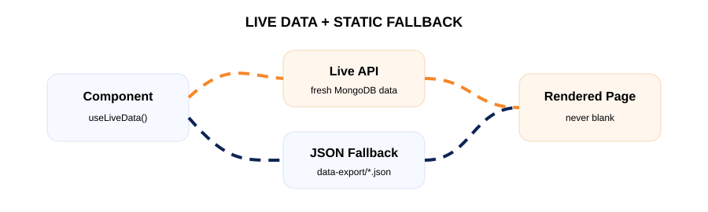
</p>

The website is **resilient by design**:

```
Component
   │
   ├── 🟢 Live API reachable  →  useLiveData() fetches fresh content from the backend
   │
   └── 🔴 API offline         →  falls back to bundled static JSON (data-export/*.json)
                                   →  pages still render with full content & media
```

- Every page component consumes a typed data layer (`src/services/data.service.ts`) with the `useLiveData` hook — renders the bundled JSON instantly, then swaps in live data when the backend responds.
- Media (images/PDFs) is served from `/public` locally; the same paths map to backend uploads.
- This means the site **never shows a blank page**, even with the backend fully disconnected.

---

## 🎨 Design System

<p align="center">
  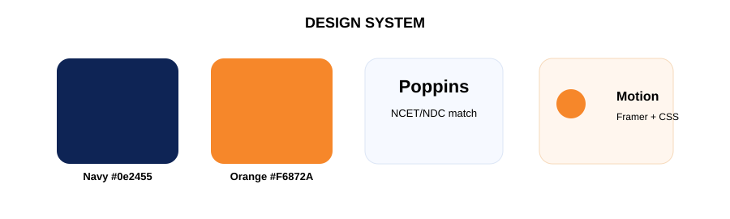
</p>

<div align="center">

| Token | Value | Usage |
| --- | --- | --- |
| 🎨 **Navy** | `#0e2455` | Headings, buttons, banners, footer |
| 🎨 **Orange** | `#F6872A` | Accents, CTAs, highlights, badges |
| 🔤 **Typography** | Poppins / system stack | Consistent across all pages (matching NCET/NDC) |
| ✨ **Motion** | Framer Motion + CSS keyframes | Scroll reveals, count-ups, floating icons, pulse rings, image shimmers, hover lifts |
| 📐 **Radius** | 12–32 px | Cards, buttons, banners |
| ♿ **Accessibility** | `prefers-reduced-motion` | All animations gracefully disabled for users who prefer it |

</div>

<p align="center">
  
  
  
</p>

---

## 📄 Pages & Routes

<p align="center">
  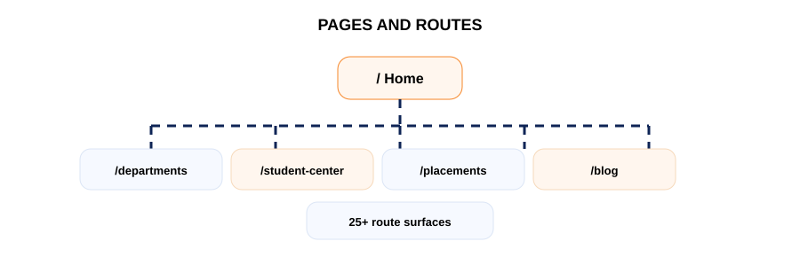
</p>

| Route | Page |
| --- | --- |
| `/` | Home (hero, stats, about, accreditations, recruiters…) |
| `/about-ncms` | About NCMS |
| `/departments` · `/department/[id]/[tab]` | Departments + per-department tabs |
| `/blog` · `/blog/[id]` | Blog listing + article detail |
| `/events` · `/gallery` | Events & photo gallery |
| `/iic` | Institution's Innovation Council |
| `/iqac` | Internal Quality Assurance Cell |
| `/placements` | Placements, recruiters, activities |
| `/samashti` | Samashti (annual magazine) |
| `/student-center` | Student center, policies, progression |
| `/student-center/…` | 17 subpages — academic enrichment, community services & statutory cells |
| `/uucms` | UUCMS college manual & portals |
| `/news-clippings` · `/news-letter` | News & newsletter volumes |
| `/contact-us` · `/apply-now` | Contact & admissions forms |
| `/mandatory-disclosure` · `/audit-reports` | Compliance documents |
| `/anti-ragging` | Anti-ragging policy |

---

## 🧰 Available Scripts

<p align="center">
  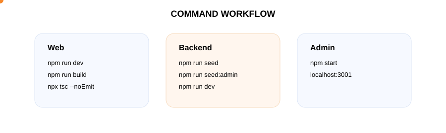
</p>

| Project | Command | Action |
| --- | --- | --- |
| `ncms-web-main` | `npm run dev` | Start Next.js dev server (`:3100`) |
| `ncms-web-main` | `npm run build` / `npm start` | Production build & serve |
| `ncms-web-main` | `npx tsc --noEmit` | Typecheck the whole site |
| `ncms-backend-main` | `npm run seed` | Seed MongoDB from JSON |
| `ncms-backend-main` | `npm run seed:admin` | Create the admin account |
| `ncms-backend-main` | `npm run dev` | Start Express API (`:4001`) |
| `ncms-admin-main` | `npm start` | Start admin panel (`:3001`) |

---

## 👨‍💻 Developer Notes

<p align="center">
  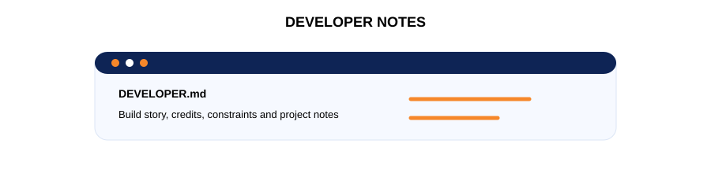
</p>

Built and maintained by **Jayanth** — see [`DEVELOPER.md`](DEVELOPER.md) for the full developer notes, credits and build story.

---

## 🤝 Contributing

<p align="center">
  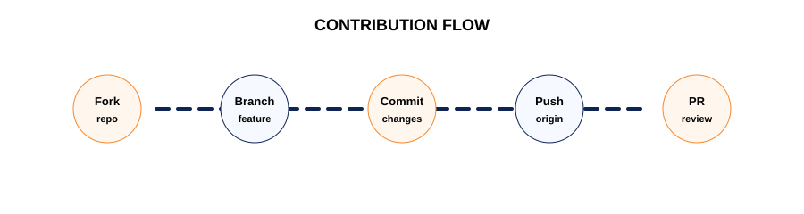
</p>

Contributions make this project better! To contribute:

1. 🍴 Fork the repository
2. 🌿 Create a feature branch — `git checkout -b feat/amazing-feature`
3. 💾 Commit your changes — `git commit -m 'feat: add amazing feature'`
4. 📤 Push — `git push origin feat/amazing-feature`
5. 🔀 Open a Pull Request

Please keep the design language consistent (navy `#0e2455` / orange `#F6872A`), run `npx tsc --noEmit` before pushing, and respect the existing component conventions.

---

## 📜 License

<p align="center">
  
</p>

This project is proprietary and maintained for **Nagarjuna College of Management Studies**. All content, branding and media belong to the college.

---

<div align="center">


**Made with ❤️ for Nagarjuna College of Management Studies, Bengaluru**

_🚀 Powered by Next.js · Express · MongoDB · React — rendered with 100% SVG + SMIL, zero JavaScript_

</div>
