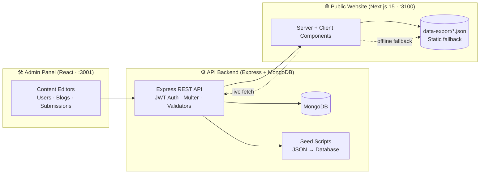

<div align="center">


# 🎓 NCMS-SITE

### Nagarjuna College of Management Studies — Official Website Platform

_A premium, content-driven institutional website built with **Next.js**, powered by an **Express + MongoDB** API with **seeding**, and managed through a dedicated **React Admin Panel** — every page beautifully designed in the NCET/NDC design language._


</div>

---

## 📖 Table of Contents

- [About The Project](#-about-the-project)
- [✨ Key Features](#-key-features)
- [🏗️ Architecture](#️-architecture)
- [🧱 Tech Stack](#-tech-stack)
- [📁 Project Structure](#-project-structure)
- [🚀 Getting Started](#-getting-started)
  - [1. Public Website (`ncms-web-main`)](#1-public-website-ncms-web-main)
  - [2. API Backend (`ncms-backend-main`)](#2-api-backend-ncms-backend-main)
  - [3. Admin Panel (`ncms-admin-main`)](#3-admin-panel-ncms-admin-main)
- [🔐 Environment Variables](#-environment-variables)
- [🗄️ Data Architecture](#️-data-architecture)
- [🎨 Design System](#-design-system)
- [📄 Pages & Routes](#-pages--routes)
- [🧰 Available Scripts](#-available-scripts)
- [👨‍💻 Developer Notes](#-developer-notes)
- [🤝 Contributing](#-contributing)
- [📜 License](#-license)

---

## 📌 About The Project

**NCMS-SITE** is the complete digital ecosystem for **Nagarjuna College of Management Studies**, Bengaluru — a three-part platform:

| Layer | What it does |
| --- | --- |
| 🌐 **Public Website** | The student-facing **Next.js 15** site — 25+ pages with animations, image galleries, PDF document libraries, blogs and contact flows. |
| ⚙️ **API Backend** | **Express + MongoDB** REST API that mirrors the content collections, seeds the database from JSON, and powers both the website and the admin panel. |
| 🛠️ **Admin Panel** | A **React** dashboard (port `3001`) for managing content, users, blogs and submissions with a polished Skote-style UI. |

> 💡 **Design philosophy:** the UI is pixel-matched to the **NCET** and **NDC** college websites — same typography, same spacing, same navy `#0e2455` + orange `#F6872A` identity, same micro-interactions — but with **NCMS content** throughout.

---

## ✨ Key Features

### 🌐 Website Highlights
- **25+ fully responsive pages** — Home, About, Academics, Departments, Blog, Gallery, Placements, IIC, IQAC, Samashti, Student Center, UUCMS, News & more.
- **Department hub** — every department has its own routed page with tabbed content: **About · HOD Message · Vision & Mission · PEOs · Syllabus · Faculty**.
- **Premium animations** — Framer Motion scroll reveals, floating animated icons, pulse rings, image shimmers, count-up stats and Swiper carousels.
- **Rich media** — photo galleries, PDF document libraries (reports, policies, circulars, feedback forms) and image-rich blog articles.
- **Graceful data fallback** — the site reads from the live API first, then falls back to the bundled `data-export/*.json` so it *never* shows a blank page.
- **Accessibility & polish** — reduced-motion support, keyboard-accessible cards, lazy-loaded images with fallback + shimmer, WCAG-minded contrast.

### ⚙️ Backend Highlights
- Express + **Mongoose** API with **JWT authentication**, role-based routes, `multer` file uploads and `express-validator`.
- **Seeding scripts** — populate the entire MongoDB database from JSON in one command (`npm run seed`).

### 🛠️ Admin Panel Highlights
- Login with **OTP flow**, role-aware dashboards, content editors, users & blogs management.
- Tabbed UI with **transition animations**, one design language across every screen.
- SweetAlert2 confirmations, toast notifications and a full Skote-style sidebar layout.

---

## 🏗️ Architecture



---

## 🧱 Tech Stack

<div align="center">
  
</div>

| Layer | Technology | Purpose |
| --- | --- | --- |
| **Frontend** | [Next.js 15.2](https://nextjs.org) · React 19 · TypeScript 5 | App Router, Server/Client components, SSR + hydration |
| **Styling** | Tailwind CSS v4 · SCSS/Sass · Mantine 7 | Utility-first styling, custom design-system SCSS, UI primitives |
| **Motion** | Framer Motion 12 · Swiper 11 | Scroll reveals, count-ups, carousels, micro-interactions |
| **Icons** | lucide-react · react-icons · Font Awesome · Tabler | Consistent iconography across every page |
| **Forms** | react-hook-form | Contact & apply-now forms with validation |
| **API** | Express 4 · Mongoose 7 · MongoDB · JWT | REST API, auth, uploads, seeding |
| **Admin** | React 18 · Redux Toolkit · reactstrap · Bootstrap 5 | Admin dashboard on port `3001` |

---

## 📁 Project Structure

```
ncms-new/
├── 📄 README.md                      ← you are here
├── 📄 DEVELOPER.md                   ← developer notes & credits
├── 🎞️ assets/                        ← animated SVG loaders used in docs
│
├── 🌐 ncms-web-main/                 # Public website (Next.js 15)
│   ├── src/
│   │   ├── app/                      # App Router pages (25+ routes)
│   │   │   ├── page.tsx              #   Home
│   │   │   ├── about-ncms/           #   About NCMS
│   │   │   ├── departments/          #   Departments overview
│   │   │   ├── department/[id]/[tab] #   Department detail (About/HOD/PEO/Syllabus…)
│   │   │   ├── blog/ + blog/[id]/    #   Blog listing + article
│   │   │   ├── gallery/  events/     #   Galleries & events
│   │   │   ├── iic/     iqac/        #   Innovation Council · IQAC
│   │   │   ├── placements/ samashti/ #   Placement · Samashti
│   │   │   ├── student-center/ uucms #   Student Center · UUCMS
│   │   │   └── news-clippings/ news-letter/  # News sections
│   │   ├── components/               # Reusable UI (Header, Footer, PageBanner,
│   │   │                             #   BlogCard, DepartmentTabs, HomeNCET …)
│   │   ├── styles/ncet/              # Design-system SCSS/CSS
│   │   ├── data-export/              # Bundled static JSON fallbacks
│   │   ├── services/                 # API service layer
│   │   └── hooks/                    # useLiveData (live → JSON fallback)
│   └── public/                       # Images, PDFs, uploads
│
├── ⚙️ ncms-backend-main/             # API backend (Express + MongoDB)
│   ├── app.js                        # Express bootstrap
│   ├── models/  routes/  controllers/# MVC modules
│   ├── seed/                         # runSeed.js · seedAdmin.js
│   └── scripts/                      # Module generator
│
└── 🛠️ ncms-admin-main/               # Admin panel (React · :3001)
    └── src/                          # Skote-style dashboard, editors, auth
```

---

## 🚀 Getting Started

> **Prerequisites:** Node.js ≥ 18, npm ≥ 6, MongoDB running locally.

Clone the repository and install each layer:

```bash
git clone https://github.com/jayanth-torii/NCMS-SITE.git
cd NCMS-SITE
```

### 1. Public Website (`ncms-web-main`)

```bash
cd ncms-web-main
npm install
npm run dev        # → http://localhost:3100
```

> ⚙️ The site works **out of the box** using the bundled `data-export/*.json` files. Point it at the live backend by configuring the API base URL (see [Environment Variables](#-environment-variables)).

### 2. API Backend (`ncms-backend-main`)

```bash
cd ncms-backend-main
npm install
cp .env.example .env       # configure MONGODB_URI, JWT_SECRET, PORT
npm run seed               # seed every collection from JSON
npm run dev                # → http://localhost:4001
```

### 3. Admin Panel (`ncms-admin-main`)

```bash
cd ncms-admin-main
npm install
npm start                  # → http://localhost:3001
```

---

## 🔐 Environment Variables

### `ncms-web-main/.env`

| Variable | Description | Default |
| --- | --- | --- |
| `NEXT_PUBLIC_API_URL` | Live backend base URL | `http://localhost:4001` |

### `ncms-backend-main/.env`

| Variable | Description |
| --- | --- |
| `PORT` | API port (default `4001`) |
| `MONGODB_URI` | MongoDB connection string |
| `JWT_SECRET` | Token signing secret |
| `ADMIN_EMAIL` / `ADMIN_PASSWORD` | Default admin seed credentials |

---

## 🗄️ Data Architecture

The website is **resilient by design**:

```
Component
   │
   ├── 🟢 Live API reachable  →  useLiveData() fetches fresh content from the backend
   │
   └── 🔴 API offline         →  falls back to bundled static JSON (data-export/*.json)
                                  →  pages still render with full content & media
```

- Every page component consumes a typed data layer (`src/services/data.service.ts`) with the `useLiveData` hook.
- Media (images/PDFs) is served from `/public` locally; the same paths map to backend uploads.
- This means the site **never shows a blank page**, even with the backend fully disconnected.

---

## 🎨 Design System

| Token | Value | Usage |
| --- | --- | --- |
| 🎨 **Navy** | `#0e2455` | Headings, buttons, banners, footer |
| 🎨 **Orange** | `#F6872A` | Accents, CTAs, highlights, badges |
| 🔤 **Typography** | Poppins / system stack | Consistent across all pages (matching NCET/NDC) |
| ✨ **Motion** | Framer Motion + CSS keyframes | Scroll reveals, count-ups, floating icons, pulse rings, image shimmers, hover lifts |
| 📐 **Radius** | 12–32 px | Cards, buttons, banners |
| ♿ **Accessibility** | `prefers-reduced-motion` | All animations gracefully disabled for users who prefer it |

<div align="center">
  
  
</div>

---

## 📄 Pages & Routes

| Route | Page |
| --- | --- |
| `/` | Home (hero, stats, about, accreditations, recruiters…) |
| `/about-ncms` | About NCMS |
| `/departments` · `/department/[id]/[tab]` | Departments + per-department tabs |
| `/blog` · `/blog/[id]` | Blog listing + article detail |
| `/events` · `/gallery` | Events & photo gallery |
| `/iic` | Institution's Innovation Council |
| `/iqac` | Internal Quality Assurance Cell |
| `/placements` | Placements, recruiters, activities |
| `/samashti` | Samashti (annual magazine) |
| `/student-center` | Student center, policies, progression |
| `/uucms` | UUCMS college manual & portals |
| `/news-clippings` · `/news-letter` | News & newsletter volumes |
| `/contact-us` · `/apply-now` | Contact & admissions forms |
| `/mandatory-disclosure` · `/audit-reports` | Compliance documents |
| `/anti-ragging` | Anti-ragging policy |

---

## 🧰 Available Scripts

| Project | Command | Action |
| --- | --- | --- |
| `ncms-web-main` | `npm run dev` | Start Next.js dev server (`:3100`) |
| `ncms-web-main` | `npm run build` / `npm start` | Production build & serve |
| `ncms-web-main` | `npx tsc --noEmit` | Typecheck the whole site |
| `ncms-backend-main` | `npm run seed` | Seed MongoDB from JSON |
| `ncms-backend-main` | `npm run dev` | Start Express API (`:4001`) |
| `ncms-admin-main` | `npm start` | Start admin panel (`:3001`) |

---

## 👨‍💻 Developer Notes

Built and maintained by **Jayanth** — see [`DEVELOPER.md`](DEVELOPER.md) for the full developer notes, credits and build story.

---

## 🤝 Contributing

Contributions make this project better! To contribute:

1. 🍴 Fork the repository
2. 🌿 Create a feature branch — `git checkout -b feat/amazing-feature`
3. 💾 Commit your changes — `git commit -m 'feat: add amazing feature'`
4. 📤 Push — `git push origin feat/amazing-feature`
5. 🔀 Open a Pull Request

Please keep the design language consistent (navy `#0e2455` / orange `#F6872A`), run `npx tsc --noEmit` before pushing, and respect the existing component conventions.

---

## 📜 License

This project is proprietary and maintained for **Nagarjuna College of Management Studies**. All content, branding and media belong to the college.

---

<div align="center">

**Made with ❤️ for Nagarjuna College of Management Studies, Bengaluru**


_🚀 Powered by Next.js · Express · MongoDB · React_

</div>
